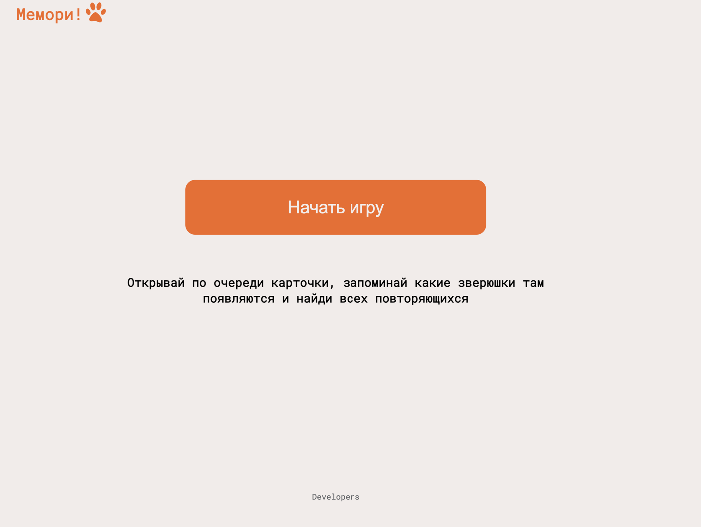

# Мемори!
[Открыть приложение](https://govyazina.github.io/junior-hackathon_team__14/)

### Команда
Приложение сделано в рамках благотворительного хакатона командой 14.
В создании участвовали:

[Виктор](https://t.me/Zelvar)

[Илья](https://t.me/fensin)

[Наталья](https://t.me/NataliaSitnikova)

[Света](https://t.me/govyazina)

### Стек проекта 
React.js, HTML, CSS, JS

### Дизайн
[Фигма](https://www.figma.com/file/jC9yujlWYVSnhCKWdEquQ0/Memory!?type=design&node-id=404%3A574&mode=design&t=fEVohREMC9w7yoCu-1)

### Описание

**Мемори!** — игра с карточками, которые открываются попарно, и задача - открыть все карточки за наименьшее количество ходов.

### Фичи
####  1. начальный экран с кратким описанием механики игры

#### 2. экран с игровым полем

вывод поля с рандомно расположенными карточками (каждый раунд - новая позиция карточек);
возможность открывать карточки;
закрытие непарных карточек, парные - остаются открытыми;
подсчет количества ходов;
возможность начать игру заново;
таймер;

#### 3. экран поздравления с окончанием игры

### 3.1 добавлена история ходов с возможностью проигрывания хода партии

   
### Для локального запуска проекта:

`npm i`

`npx vite`

### Деплой 
происходит автоматически после каждого пуша в `main`
ссылка [здесь](https://govyazina.github.io/junior-hackathon_team__14/)

